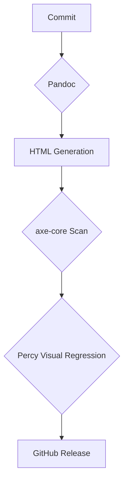

# Pipeline Overview

This document outlines the data-flow for the engineering pipeline.

## Artefacts

The pipeline produces several verifiable artefacts.

- JSON (from axe-core scans).
- PNG (from Percy snapshots).
- SPDX (for the Software Bill of Materials).
